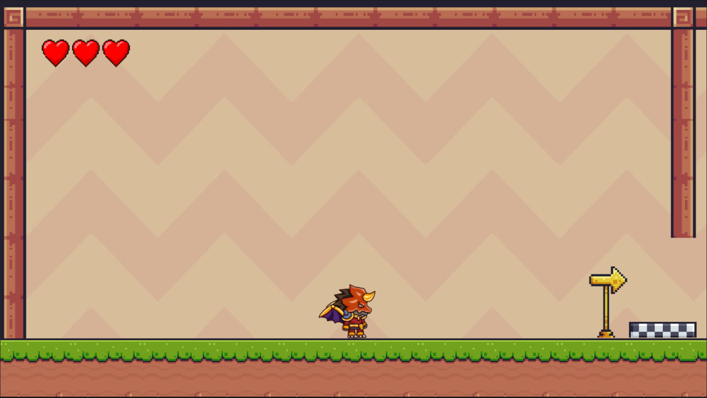
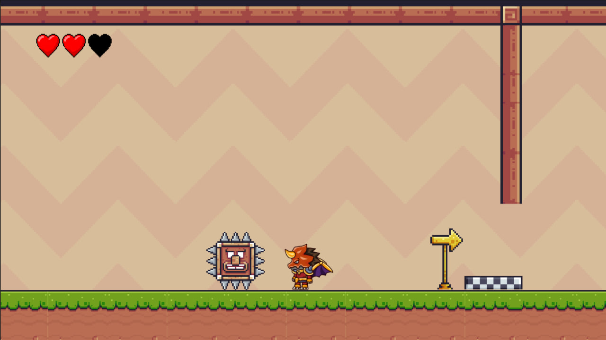
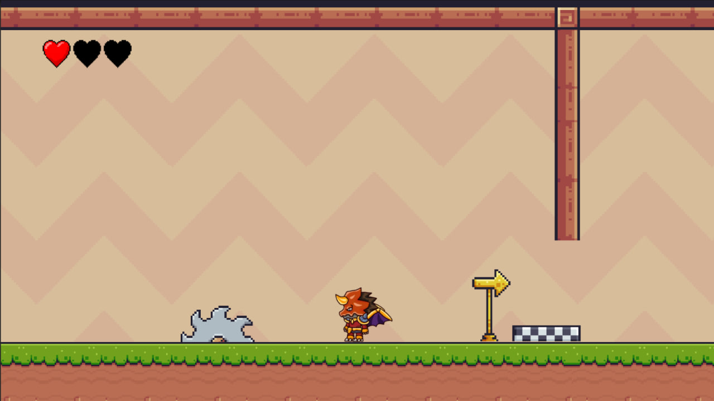

# 2D-Platformer

A Unity-powered 2D platformer where players navigate through levels filled with obstacles and enemies.


## Features
- **Engaging Levels**: Traverse diverse stages with unique challenges.
- **Responsive Controls**: Enjoy smooth character movement and jumping mechanics.
- **Dynamic Enemies**: Encounter various foes with distinct behaviors.

## Installation

1. **Clone the Repository**:

   ```bash
   git clone https://github.com/vosidovmsaid2007/2D-Platformer.git
2. **Open in Unity**:

   - Launch Unity Hub.
   - Click on the "Add" button and select the cloned repository folder.
   - Open the project in Unity Editor.

3. **Play the Game**:

   - In the Unity Editor, press the "Play" button to start the game.

## Images from Game




## License

This project is licensed under the MIT License. See the [MIT](https://opensource.org/license/mit/) file for details.

## Acknowledgments

- Developed by Vosidov Muhammadsaid.
- Special thanks to the Unity community for their support and resources.

---

Feel free to share your feedback or ideas to improve the game. Happy gaming!

